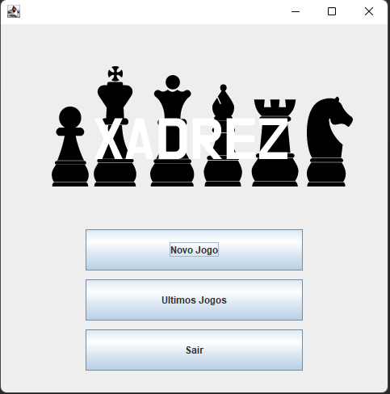

# Xadrez no java

    Este projeto foi um trabalho para a disciplina de Paradigmas da programação B (4 semestre) efetudado durante o ano de 2022
   
   Iniciando um novo jogo, voce deve inserir o nome dos dois jogadores
   
   
   Tela de carregamento
   
   Tabuleiro montado
   
   Para cada peça existe a possibilidade de movimento que podem ser efetuadas seguindo as regras dos 
   <a href="https://www.tabuleirodexadrez.com.br/regras-do-xadrez.html">Xadrez </a>
   
   Para empates e Mates o jogo é finalizado informando o resultado(Brancas,Pretas,Empate).
     
   O empate é declarado em caso de falta de peça, rei afogado, empate pela regra dos cinquenta movimentos e claro caso um dos jogadores porponham o empate e o adversario aceite
   
Quando um jogo é finalizado todas as jogadas sao colocadas em um arquivo de texto podendo assim ser reproduzidos atravez do menu (ultimos jogos)
   
   apertando o botão de |> voce controla os movimentos do ultimo jogo.
   

